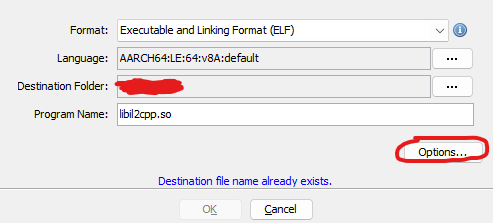
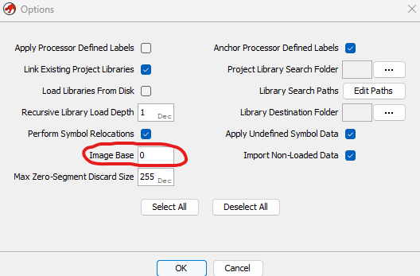
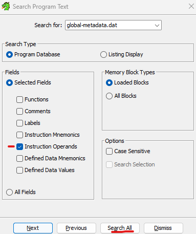
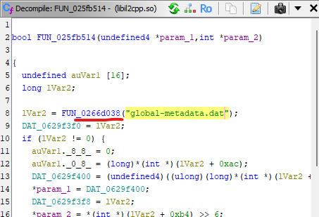

# Il2CppMetadataExtractor
Simple and easy to use [Frida](https://frida.re/) script for dumping decrypted Il2cpp global-metadata.dat files from a Unity application's memory. Tested on Android.

The extracted global-metadata.dat file plus it's corresponding libil2cpp.so file can be used with tools such as [Il2CppInspector](https://github.com/djkaty/Il2CppInspector)/[Il2CppInspectorRedux](https://github.com/LukeFZ/Il2CppInspectorRedux) and ultimately [Ghidra](https://github.com/NationalSecurityAgency/ghidra) or [IDA](https://hex-rays.com/) in order to aid in the reverse engineering of il2cpp Unity projects.

It is often the case that the global-metadata.dat file is encrypted, this tool allows you to dump a decrypted copy of the file.

## Usage
```sh
python dump-metadata.py package_name offset
```

example package name:
com.company.appname

example offset:
0x1234567

## How to locate the offset
This example will use Ghidra, a similar process can be followed using IDA.

Step 1:
Locate the libil2cpp.so file in your project. In an Android project, it will be located in an APK file.

Step 2:
Create a new Ghidra project and add the file. Open the file in the editor, make sure to open options and set the image base to zero.





Step 3:
When opening the file for the first time, Ghidra will ask if you want to run the standard analysis on the file. Run the analysis and wait for it to finish completely.

Step 4:
Open the search function in Ghidra (ctrl + shift + E) and "Search All" for "global-metadata.dat". Ensure that you at least have "Instruction Operands" selected under "Fields" when you begin your search.



Eventually you should see a reference to "global-metadata.dat" in your search results. It may take a long time. Select that option and you will find a disassembled function that looks something like this:



The name of the function which is called with the file name as it's parameter is also the offset value you need. In this example it would be 0x266d038